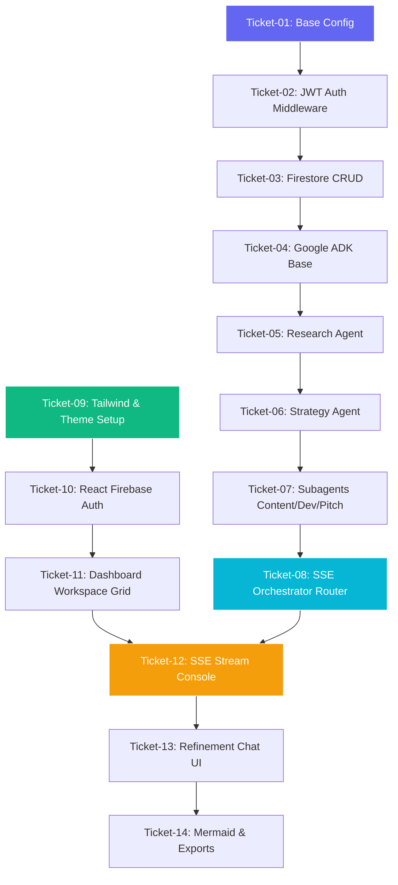

# Feature Tickets Document - COMET

## 1. Context

To build COMET systematically from scratch, the development roadmap must be decomposed into granular, self-contained feature tickets. Each ticket serves as an independent, buildable unit of work that ensures code logic remains cohesive and testable. Defining clear dependencies and specific instructions prevents architectural drift and simplifies implementation for developer agents.

---

## 2. Objective

The objective of this document is to map out the exact development tickets needed to implement the COMET platform from the baseline up. Each ticket details its requirements, priority, complexity, verification notes, dependencies, and contains a comprehensive implementation prompt. This allows developers or AI subagents to tackle tickets sequentially with clear direction and zero ambiguity.

---

## 3. Scope

### In Scope
- **Granular Feature Breakdown**: 14 developer tickets spanning backend environment setup, auth integration, agent coding (ADK), orchestration routing (SSE), React layout creation, real-time sync, refinement chat, and exporting.
- **Priority and Complexity Estimates**: Quantified using standard priority levels and story points.
- **Dependency Flow**: A clear path showing which backend tasks must complete before frontend views are implemented.

### Out of Scope
- **Sprint Scheduling & Assignee Allocation**: Project management metrics outside system requirements.
- **Continuous Integration Pipeline Construction**: Creating the specific yaml tasks (these are noted in architecture but do not need separate feature tickets for application MVP execution).

---

## 4. Detailed Explanation & Individual Tickets

### Ticket 1: Backend Environment & Base Config Setup
- **Feature**: Backend Infrastructure Setup
- **Description**: Configure the base FastAPI application structure with environment variables loaded through Pydantic `BaseSettings`. Include a health check route (`/health`) and structured logging middleware.
- **Acceptance Criteria**:
  1. Running the FastAPI server locally starts on port `8000`.
  2. Navigating to `http://localhost:8000/health` returns `{"status": "healthy"}` with a `200 OK` code.
  3. All configurations load from an `.env` file; missing variables trigger a startup crash with descriptive error logs.
- **Dependencies**: None
- **Priority**: High
- **Estimated Complexity**: 2 Story Points
- **Testing Notes**: Run `pytest` on `/health` endpoint. Verify that `.env` loading crashes if mandatory keys are missing.
- **Implementation Prompt**:
  ```text
  Set up a FastAPI project inside the "backend" directory. Configure app/main.py with a GET "/health" endpoint returning a health status dictionary. Implement app/core/config.py using pydantic-settings to load database URLs, Firebase credentials path, and GEMINI_API_KEY from environment variables. Set up structured JSON logging in app/core/logging.py.
  ```

---

### Ticket 2: User Authentication & Auth Middleware
- **Feature**: Backend Auth Security
- **Description**: Build a FastAPI security dependency using the `firebase-admin` SDK. Parse the `Authorization: Bearer <token>` header, verify the JWT signature, check expiration, and retrieve the user's `uid` and `email`.
- **Acceptance Criteria**:
  1. Requests without headers or with malformed headers return `401 Unauthorized`.
  2. Requests with expired or invalid signatures return `401 Unauthorized`.
  3. Requests with valid tokens decode successfully and pass the user context to the route handler.
- **Dependencies**: Ticket 1
- **Priority**: High
- **Estimated Complexity**: 3 Story Points
- **Testing Notes**: Mock Firebase SDK token verification in tests to simulate valid, expired, and corrupt keys.
- **Implementation Prompt**:
  ```text
  Create app/api/auth.py containing a get_current_user security dependency. Use firebase_admin.auth.verify_id_token to validate incoming HTTPBearer JWTs. Extract user credentials (uid, email, role) and throw a 401 HTTPException with details if validation fails.
  ```

---

### Ticket 3: Firestore Database Clients & Workspace Schema
- **Feature**: Database Infrastructure & CRUD
- **Description**: Initialize the Firestore admin client and write Pydantic schemas for the Workspace model. Create CRUD functions to save and retrieve workspace data inside `app/db/firestore.py`.
- **Acceptance Criteria**:
  1. Creating a workspace writes a structured document to the `/workspaces` collection.
  2. Reading a workspace fetches matching keys.
  3. Users can only read/write workspaces matching their authenticated `userId`.
- **Dependencies**: Ticket 2
- **Priority**: High
- **Estimated Complexity**: 3 Story Points
- **Testing Notes**: Write unit tests to check database read/write routines using a Firestore emulator.
- **Implementation Prompt**:
  ```text
  Create app/db/firestore.py to initialize the Firebase Admin client. Define Pydantic validation models in app/schemas/workspace.py corresponding to the Workspace schema in the Technical Architecture document. Implement functions to create, read, update, and delete workspace documents. Ensure queries filter by userId.
  ```

---

### Ticket 4: Base Agent and Google ADK Integration
- **Feature**: Multi-Agent Core Engine
- **Description**: Integrate the Google ADK (Agent Development Kit). Define the abstract class `COMETBaseAgent` that configures Gemini 2.5 Flash execution parameters and structures the prompt interface.
- **Acceptance Criteria**:
  1. All agents extend the `COMETBaseAgent` parent class.
  2. Agents accept a shared dictionary context and return standard outputs.
  3. Gemini 2.5 Flash execution uses `temperature=0.4` by default.
- **Dependencies**: Ticket 3
- **Priority**: High
- **Estimated Complexity**: 3 Story Points
- **Testing Notes**: Instantiate a mock agent class and verify it successfully queries Gemini and returns output.
- **Implementation Prompt**:
  ```text
  Create app/agents/base.py containing the abstract class COMETBaseAgent. Inject the Google ADK configuration and Gemini 2.5 Flash model references. Build default execution parameters (temperature=0.4, max_output_tokens=4000) and structure error handling for API timeouts.
  ```

---

### Ticket 5: Research Agent Specific Prompt & Tool Integration
- **Feature**: Research Agent Implementation
- **Description**: Build the `ResearchAgent` class extending `COMETBaseAgent`. Configure its system prompt to analyze business concepts, perform competitor analysis, estimate TAM/SAM/SOM, and compile a structured Markdown report.
- **Acceptance Criteria**:
  1. Outputs contain a structured JSON payload with keys: `report`, `competitors`, and `tam_sam_som`.
  2. Competitors are structured as a list of dictionaries containing name, strengths, and weaknesses.
  3. Outputs validate against the Pydantic schema before returning.
- **Dependencies**: Ticket 4
- **Priority**: Medium
- **Estimated Complexity**: 3 Story Points
- **Testing Notes**: Run the research agent with a mock business idea and assert that the returned dictionary matches the Pydantic schema structure.
- **Implementation Prompt**:
  ```text
  Implement app/agents/research.py. Create the ResearchAgent class. Define its system instructions focused on competitive landscapes and market sizing. Use Gemini 2.5 Flash structured output mode to force a response matching the Research Pydantic schema defined in app/schemas/agent.py.
  ```

---

### Ticket 6: Strategy Agent Pricing & Business Canvas Prompts
- **Feature**: Strategy Agent Implementation
- **Description**: Build the `StrategyAgent` class. Design the prompt to ingest the business concept and the market research data from Ticket 5, then construct a Lean Business Canvas, pricing tiers, and a 90-day roadmap.
- **Acceptance Criteria**:
  1. The Strategy Agent reads the competitor and market size output from the Research Agent.
  2. Outputs contain a structured Lean Canvas model (Problem, Solution, Channels, Revenue Streams).
  3. Pricing tiers suggest exactly 3 tiered plans (e.g., Free, Starter, Enterprise).
- **Dependencies**: Ticket 5
- **Priority**: Medium
- **Estimated Complexity**: 3 Story Points
- **Testing Notes**: Run the Strategy Agent feeding it dummy Research output. Check that pricing and canvas items are populated correctly.
- **Implementation Prompt**:
  ```text
  Implement app/agents/strategy.py. Create the StrategyAgent class. The agent must consume the Research output from the shared context. Structure system instructions to output a validated Lean Business Canvas, 3 distinct pricing tiers, and a chronological launch roadmap.
  ```

---

### Ticket 7: Content, Development, & Pitch Agent Specific Prompts
- **Feature**: Subagents Asset Creation
- **Description**: Implement the remaining specialized agents (`ContentAgent`, `DevelopmentAgent`, `PitchAgent`) extending the base agent class. Establish system instructions for marketing materials, database/system architecture drafts, and slide deck decks.
- **Acceptance Criteria**:
  1. Content Agent outputs 3 launch emails and a social schedule.
  2. Development Agent outputs Mermaid charts and database structure text.
  3. Pitch Agent outputs an 8-slide deck layout.
- **Dependencies**: Ticket 6
- **Priority**: Medium
- **Estimated Complexity**: 5 Story Points
- **Testing Notes**: Execute all three agents in sequence with dummy inputs and verify output schemas.
- **Implementation Prompt**:
  ```text
  Create app/agents/content.py, app/agents/development.py, and app/agents/pitch.py. Write specialized system prompts for each agent based on the requirements in Table 1 of the PRD. Ensure all output shapes validate against Pydantic definitions before updating the context.
  ```

---

### Ticket 8: Sequential Orchestrator State Machine & SSE Streaming
- **Feature**: Orchestrator Router Implementation
- **Description**: Build the `OrchestrationRouter` and the POST `/workspaces/{id}/run` API. Program the step-by-step state machine (Research -> Strategy -> Pitch etc.) and stream logs and output deltas using FastAPI Server-Sent Events (SSE).
- **Acceptance Criteria**:
  1. Invoking the run endpoint starts sequential agent execution.
  2. Progress is streamed back to the client using EventStream protocols (`event: agent_thought`, `event: agent_stream`).
  3. In-progress states are updated in the Firestore Workspace document.
- **Dependencies**: Ticket 7
- **Priority**: High
- **Estimated Complexity**: 5 Story Points
- **Testing Notes**: Execute the endpoint using a stream-aware HTTP client (e.g. `curl -N`) and verify events are output sequentially.
- **Implementation Prompt**:
  ```text
  Create app/orchestration/router.py. Define the run_workspace endpoint using EventSourceResponse (from sse-starlette or custom async generator). Coordinate the execution of Research, Strategy, and remaining agents. Stream thought logs and partial text chunks dynamically. Update the Firestore workspace state to RUNNING and COMPLETED respectively.
  ```

---

### Ticket 9: React Project Setup & Design Token Styling
- **Feature**: Frontend Base Setup
- **Description**: Create the frontend skeleton using React (Vite) and Tailwind CSS. Configure `tailwind.config.js` with the dark-theme color palette, gradients, and font families.
- **Acceptance Criteria**:
  1. Running Vite server launches local development.
  2. Tailwind CSS loads correctly; checking global styles displays the deep space slate background (`#090D16`).
  3. Web fonts (Inter & Outfit) load from Google Fonts.
- **Dependencies**: None
- **Priority**: High
- **Estimated Complexity**: 2 Story Points
- **Testing Notes**: Open the homepage in a browser and check computed styles using Developer Tools to confirm colors and fonts match specs.
- **Implementation Prompt**:
  ```text
  Initialize a React Vite application in the "frontend" directory. Install Tailwind CSS. Configure tailwind.config.js to include primary indigo, secondary cyan, and slate-950 background colors as tokens. Import Outfit and Inter fonts in src/index.css. Build a baseline Layout container.
  ```

---

### Ticket 10: Frontend Authentication Screen & Profile Hook
- **Feature**: Frontend Authentication
- **Description**: Integrate the Firebase Web SDK. Create the Login and Signup screen UI using glassmorphic borders and glowing styles, and write an `AuthContext` to manage tokens.
- **Acceptance Criteria**:
  1. Users can sign up and login via email/password or Google authentication.
  2. Successful login redirect routes users to the Dashboard page.
  3. Auth headers are automatically attached to API clients.
- **Dependencies**: Ticket 9
- **Priority**: High
- **Estimated Complexity**: 3 Story Points
- **Testing Notes**: Test authentication flow by performing user creation and logout actions. Confirm token is saved in state.
- **Implementation Prompt**:
  ```text
  Implement Firebase Auth in frontend/src/context/AuthContext.jsx. Build the AuthScreen component under src/features/auth/AuthScreen.jsx with a glassmorphic dark container. Add form inputs for Email/Password and a Google login button. Ensure state handles active user token persistence.
  ```

---

### Ticket 11: Dashboard Workspace Management Grid
- **Feature**: Workspace Dashboard UI
- **Description**: Create the main Dashboard view. Display a responsive grid of workspaces, a search input, and a "New Workspace" configuration modal that triggers the backend CRUD API.
- **Acceptance Criteria**:
  1. Lists all workspaces owned by the user.
  2. Clicking "Delete" invokes API delete.
  3. Clicking "New Workspace" opens a modal prompting for the business idea, then issues a POST request.
- **Dependencies**: Ticket 10, Ticket 3
- **Priority**: High
- **Estimated Complexity**: 3 Story Points
- **Testing Notes**: Create multiple mock workspaces via the UI and verify they display in the grid and persist.
- **Implementation Prompt**:
  ```text
  Create src/features/dashboard/WorkspaceGrid.jsx and a WorkspaceCard component. Implement API integrations for fetching and deleting workspaces. Build the "New Workspace" creation modal which posts the initial prompt to the backend.
  ```

---

### Ticket 12: Orchestrator Console Workspace View & Streaming Output
- **Feature**: Real-time Streaming UI
- **Description**: Build the Workspace Details Console. Render the sidebar navigation, the primary agent tabs (Research, Strategy etc.), and a streaming console view that handles the EventSource SSE updates.
- **Acceptance Criteria**:
  1. Agent tabs display active state (Idle, In Progress, Completed).
  2. Selecting a tab shows the text output and logs for that agent.
  3. Triggering a run opens the Orchestrator console and streams agent logs in real time.
- **Dependencies**: Ticket 11, Ticket 8
- **Priority**: High
- **Estimated Complexity**: 5 Story Points
- **Testing Notes**: Trigger a workspace execution and check that the log window updates dynamically without lag or browser freezing.
- **Implementation Prompt**:
  ```text
  Create src/features/workspace/WorkspaceDetail.jsx. Implement an EventSource listener inside a React hook to connect to the backend execution API. Update the active agent tab state based on incoming SSE events. Render a real-time terminal-style log box with auto-scrolling capabilities.
  ```

---

### Ticket 13: Individual Agent Refinement Chat Box
- **Feature**: Refinement Chat UI
- **Description**: Create an interactive chat input at the bottom of each agent tab. Submitting a message posts a refinement instruction to the backend, enabling users to edit specific deliverables.
- **Acceptance Criteria**:
  1. Users can type a refinement request (e.g., "Change pricing tier 1 price to $10").
  2. Submitting streams the revised outputs from the backend.
  3. The updated outputs are saved and rendered in the agent tab immediately.
- **Dependencies**: Ticket 12
- **Priority**: Medium
- **Estimated Complexity**: 4 Story Points
- **Testing Notes**: Send refinement prompts to the Strategy Agent and confirm that only Strategy outputs update while other tabs remain unchanged.
- **Implementation Prompt**:
  ```text
  Create src/features/workspace/RefinementChatBox.jsx. Build the UI chat bubble interface. Implement the API call to POST /workspaces/{id}/refine. Handle the streaming SSE response and overwrite the respective workspace sub-state in your local store.
  ```

---

### Ticket 14: Workspace Exports & Mermaid Compilation
- **Feature**: Markdown Export & Diagrams rendering
- **Description**: Add export buttons to download workspace contents as a compilation Markdown document. Integrate the Mermaid library to dynamically parse and render Mermaid architecture diagrams.
- **Acceptance Criteria**:
  1. Clicking "Export" downloads a complete `.md` file containing all agent assets.
  2. The Development Agent output tab renders a visual flowchart compiled from raw Mermaid code.
- **Dependencies**: Ticket 13
- **Priority**: Low
- **Estimated Complexity**: 3 Story Points
- **Testing Notes**: Export a completed workspace and inspect the `.md` formatting. Verify that Mermaid diagrams render without syntax compilation errors.
- **Implementation Prompt**:
  ```text
  Add export functionality in the workspace header using client-side file generators. Install the 'mermaid' npm package. Create a MermaidRenderer component that dynamically compiles raw string charts from the Development Agent's output.
  ```

---

## 5. Tables & Dependencies

### Table 1: Ticket Prioritization & Complexity Summary
| Ticket ID | Feature / Component | Priority | Complexity (SP) | Target Milestones |
| :--- | :--- | :--- | :--- | :--- |
| **Ticket-01** | Backend Base Config | High | 2 | Backend Foundation |
| **Ticket-02** | JWT Authentication Middleware | High | 3 | Backend Security |
| **Ticket-03** | Firestore Schemas & CRUD | High | 3 | Database Integration |
| **Ticket-04** | Google ADK Base Integration | High | 3 | Agent Foundation |
| **Ticket-05** | Research Agent Implementation | Medium | 3 | Agent Coding |
| **Ticket-06** | Strategy Agent Implementation | Medium | 3 | Agent Coding |
| **Ticket-07** | Subagents Creation (Content/Dev/Pitch)| Medium | 5 | Agent Coding |
| **Ticket-08** | SSE Orchestration Router | High | 5 | Pipeline Completion |
| **Ticket-09** | Frontend Tailwind / Theme Setup | High | 2 | Frontend Foundation |
| **Ticket-10** | React Firebase Auth Screen | High | 3 | Frontend Security |
| **Ticket-11** | Workspace Dashboard Grid UI | High | 3 | Dashboard View |
| **Ticket-12** | SSE Stream Workspace Console | High | 5 | Streaming Interface |
| **Ticket-13** | Agent Refinement Chat Interface | Medium | 4 | Interaction Loop |
| **Ticket-14** | Mermaid Layout & Markdown Exports | Low | 3 | Final Assets |

---

## 6. Diagrams (Ticket Dependencies Chart)



---

## 7. Acceptance Criteria (System Level)

To declare the COMET platform implementation fully complete:
1. **End-to-End Orchestration**: A user inputting a business idea must trigger a sequential execution pipeline of all 5 agents (Research -> Strategy -> Pitch/Dev/Content) and receive outputs within 5 minutes.
2. **Context Integrity**: The output of preceding agents must validate against structural schemas and be consumed in subsequent agent prompts.
3. **No Cross-User Context Leaks**: Multi-tenant database separation must prevent reading/writing to other users' workspaces.
4. **Fluid Frontend Updates**: The frontend console must update state incrementally without freezing during streaming sessions.

---

## 8. Future Improvements

- Add support for parallel branching agent execution to reduce the total orchestration duration.
- Implement Git integration allowing the Development Agent to push code snippets directly to GitHub.

---

## 9. Risks

- **FastAPI SSE Connection Dropouts**: Unstable network connections may interrupt streaming.
  * *Mitigation*: Enable automatic client reconnection handlers in EventSource with automatic stream position caching.
- **Gemini Out-of-Tokens Errors**: Large output context loops may trigger API blockages.
  * *Mitigation*: Run compression summarizing operations on output payloads prior to feeding them to next agent steps.

---

## 10. Notes

- Developers should run backend server and frontend client concurrently using separate terminal shells.
- All Firebase emulator configs must be verified in the development stage prior to deploying to the cloud.

---

## 11. AI Implementation Instructions

All coding AI agents implementing these tickets must strictly follow these constraints:
- **No Mock-Ups**: Code files must include full functions, dependencies, and validations. Never use inline comment placeholders like `# Todo: Implement logic here`.
- **Typing Strictness**: Code Python variables using explicit types, and build React components with explicit prop validations.

---

## 12. Validation Checklist

- [ ] Are there 14 distinct buildable tickets covering both frontend and backend?
- [ ] Does each ticket contain Feature, Description, Acceptance Criteria, Priority, Complexity, and Prompt?
- [ ] Is there a Mermaid diagram displaying the ticket dependency path?
- [ ] Is the prioritization matrix summarized in a table?
- [ ] Is the document free of Lorem Ipsum and other placeholders?
- [ ] Does the document contain the 12 required sections as per the global rules?
