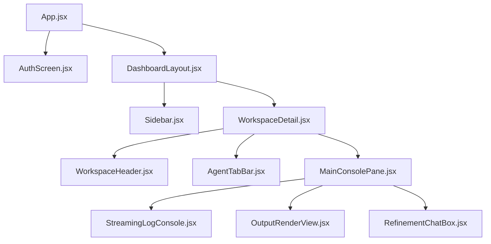

# Frontend Specification Document - COMET

## 1. Context

For a multi-agent orchestrator, the front-end user interface is not just a display layer but an active visualization engine. Users must be able to comprehend the execution sequence of collaborative agents instantly. Therefore, the visual interface must communicate status, stream text updates with low latency, and present intermediate assets (such as graphs, competitors tables, and code snippets) in a highly organized, premium layout.

---

## 2. Objective

The objective of this document is to define the design system, component guidelines, layout structures, and behavioral animations for the COMET React web client. It sets strict color palettes, typographic hierarchies, responsive grid boundaries, accessibility (WCAG 2.1) compliance standards, and interface styling rules. This ensures a consistent, high-fidelity experience that looks modern, clean, and intuitive.

---

## 3. Scope

### In Scope
- **Design Token System**: Exact HSL and hex definitions for backgrounds, texts, and states, optimized for premium dark mode and glassmorphism.
- **Component Specifications**: Reusable React components (Buttons, Input Fields, Active Workspace Cards, Agent Console Panel).
- **Dashboard Layout Grid**: Structural blueprints for navigation sidebars, tab-bars, log consoles, and action headers.
- **Micro-Animations & Transitions**: CSS/Tailwind rules for loader pulses, active indicators, and text streaming transitions.
- **Accessibility & UI Rules**: Tag structures, focus outlines, and responsive breakpoint adjustments.

### Out of Scope
- **Tailwind Config Generation Code**: Custom compilation scripts for theme injection (we specify configurations for standard `tailwind.config.js` edits).
- **Custom UI Library Dependencies**: Third-party wrapper integrations (e.g., Material UI, Chakra UI). We utilize pure Tailwind utility styling for maximum portability and custom control.

---

## 4. Detailed Explanation

### 4.1 UI Design System & Tokens
COMET uses a dark-mode first design system inspired by modern IDEs and space-themed dashboards, featuring glassmorphism elements, thin neon borders, and glowing states.

#### Colors (Tailwind Theme Tokens)
- **Deep Space Background**: `bg-slate-950` (`#090D16`)
- **Card / Surface Background**: `bg-slate-900/50` (`rgba(15, 23, 42, 0.5)`) with backdrop blur (`backdrop-blur-md`)
- **Borders**: Thin translucent borders using `border-slate-800/80` (`#1E293B`) or indigo glow `border-indigo-500/20`
- **Primary / Action Color**: Electric Indigo `text-indigo-400`, `bg-indigo-600` (`#6366F1`)
- **Secondary / Agent Glow**: Cyber Cyan `text-cyan-400`, `bg-cyan-600` (`#06B6D4`)
- **Status Success**: Emerald `bg-emerald-500` (`#10B981`)
- **Status Danger/Warning**: Crimson/Amber `text-rose-500` (`#F43F5E`) / `text-amber-500` (`#F59E0B`)

#### Typography
- **Primary Font**: `Inter` (sans-serif) for body copy, tables, inputs.
- **Display Font**: `Outfit` (sans-serif) for titles, headers, workspace labels.
- **Code Font**: `JetBrains Mono` (monospace) for database schemas, code snippets, and Mermaid charts.

---

## 5. Tables & Design Layouts

### Table 1: Typographic Hierarchy
| Class / Target | Font Family | Size | Weight | Line Height | Usage Example |
| :--- | :--- | :--- | :--- | :--- | :--- |
| `h1` | Outfit | 2.25rem (36px)| Bold (700) | 2.5rem | Main workspace titles, landing hero |
| `h2` | Outfit | 1.5rem (24px) | Semibold(600)| 2.0rem | Section headers inside agent workspaces |
| `h3` | Inter | 1.125rem (18px)| Medium (500) | 1.75rem | Card titles, modal headers |
| `body` | Inter | 0.875rem (14px)| Regular (400)| 1.5rem | Main paragraphs, descriptions |
| `code` | JetBrains Mono| 0.8125rem (13px)| Regular (400)| 1.25rem | Logs stream, Mermaid raw output, schemas |

### Table 2: Agent Tab Badge Style Matrix
| Agent Name | Theme Color | Icon Representation | Border Glow Style | Hover Transition |
| :--- | :--- | :--- | :--- | :--- |
| **Orchestrator** | Purple / Violet | `Cpu` icon | `shadow-[0_0_15px_rgba(99,102,241,0.15)]` | Scale 1.02, Indigo glow |
| **Research** | Teal / Cyan | `Search` icon | `shadow-[0_0_15px_rgba(6,182,212,0.15)]` | Scale 1.02, Cyan glow |
| **Strategy** | Emerald / Green | `TrendingUp` icon | `shadow-[0_0_15px_rgba(16,185,129,0.15)]` | Scale 1.02, Green glow |
| **Content** | Amber / Orange | `PenTool` icon | `shadow-[0_0_15px_rgba(245,158,11,0.15)]` | Scale 1.02, Amber glow |
| **Development** | Rose / Pink | `Code2` icon | `shadow-[0_0_15px_rgba(244,63,94,0.15)]` | Scale 1.02, Rose glow |
| **Pitch** | Yellow / Gold | `Award` icon | `shadow-[0_0_15px_rgba(234,179,8,0.15)]` | Scale 1.02, Yellow glow |

---

## 6. Diagrams & Wireframe Grid

### 6.1 Workspace UI Console Layout Wireframe
```text
+------------------------------------------------------------------------------------+
| SIDEBAR [comet]    | HEADER: [Workspace Title]           [Run Workspace]  [Export] |
|                    +---------------------------------------------------------------+
| + New Workspace    | TABS: [Orchestrator] [Research] [Strategy] [Dev] [Content]... |
|                    +---------------------------------------------------------------+
| Workspace List     | ACTIVE TAB PANEL (e.g., Strategy Agent Output)                |
|                    | +-----------------------------------------------------------+ |
| * Delivery SaaS    | | Deliverables Canvas                                       | |
| * Portfolio site   | | - Problem: Delivery fee complexity                        | |
| * Creator kit      | | - Pricing: Tier 1 ($15/mo), Tier 2 ($49/mo)               | |
|                    | +-----------------------------------------------------------+ |
|                    | REFINEMENT CHAT CONSOLE (Specific to Active Tab Agent)      |
|                    | +-----------------------------------------------------------+ |
| Settings           | | Agent: Strategy Agent is ready to refine this canvas.     | |
| Sign Out [User]    | | User Input: [ Adjust pricing tiers to add standard free ] | |
|                    | +-----------------------------------------------------------+ |
+------------------------------------------------------------------------------------+
```

### 6.2 Component Hierarchy Diagram


---

## 7. Acceptance Criteria

To be accepted, the frontend implementation must pass the following checks:
1. **Interactive States Consistency**: Every clickable button or nav element must have defined `:hover`, `:active`, and `:focus-visible` styles with a minimum scale and color shift animation transition of `duration-200`.
2. **Tab Isolation**: Selecting the "Research" tab must isolate the content to Research deliverables only. Selecting another tab must keep the correct corresponding agent state active without loss of data.
3. **Auto-Scroll Stream Logs**: The log streaming box must automatically scroll to the bottom when new agent logs or thoughts arrive, unless the user has manually scrolled up.
4. **Responsive Integrity**: Under mobile viewports (<768px), the navigation sidebar must collapse into a hamburger menu overlay, and the main workspaces grid must stack into a single column.
5. **No Style Leaks**: Custom styling must use CSS variables and Tailwind theme definitions in `tailwind.config.js` to ensure uniform spacing, borders, and colors throughout all pages.

---

## 8. Future Improvements

- **Drag-and-Drop Workflow Canvas**: Integrate `React Flow` to visualize the orchestrator routing as a node graph.
- **Markdown Editor**: Add a rich markdown text editor (e.g., Toast UI, Editor.js) to allow manual direct editing of agent-generated assets before export.
- **Dark/Light Mode Toggle**: Integrate complete light theme styles for users working in bright environments.

---

## 9. Risks

1. **DOM Overflow on Long Streams**: Large agent outputs generated via Gemini (10,000+ words) may cause browser rendering lag or page freeze.
   * *Mitigation*: Render streaming text chunks incrementally using React virtualized blocks or throttle component updates to 100ms intervals during active streaming.
2. **CSS Compatibility in Tailwind Updates**: Updating Tailwind CSS versions causing layout breaking shifts.
   * *Mitigation*: Lock the Tailwind CSS version in `package.json` to stable minor versions and use standard, simple classes rather than experimental features.

---

## 10. Notes

- **Third-Party Icons**: Use the `lucide-react` package for consistent icon representations throughout the app.
- **Mermaid Compilation**: Use the `@mermaid-js/mermaid-mindmap` or standard `mermaid` npm package to dynamically compile and render Mermaid text snippets generated by the Development Agent in the browser.

---

## 11. AI Implementation Instructions

Downstream frontend developers must implement UI states as follows:
- **Button Blueprint Component** (`frontend/src/components/Button.jsx`):
  ```jsx
  import React from 'react';

  export default function Button({ children, variant = 'primary', onClick, ...props }) {
    const baseStyle = "px-4 py-2 rounded-lg font-medium text-sm transition-all duration-200 focus:outline-none focus:ring-2";
    const variants = {
      primary: "bg-indigo-600 hover:bg-indigo-500 text-white shadow-lg shadow-indigo-600/20 active:scale-95 focus:ring-indigo-500",
      secondary: "bg-slate-800 hover:bg-slate-700 text-slate-200 active:scale-95 focus:ring-slate-700 border border-slate-700/80",
      outline: "bg-transparent border border-slate-800 hover:border-slate-700 text-slate-300 focus:ring-slate-800"
    };
    return (
      <button className={`${baseStyle} ${variants[variant]}`} onClick={onClick} {...props}>
        {children}
      </button>
    );
  }
  ```
- **Interfacing with SSE Stream**: Ensure standard event listeners are cleaned up inside `useEffect` blocks:
  ```javascript
  const eventSource = new EventSource(`/api/v1/workspaces/${id}/run`, { headers: ... });
  eventSource.addEventListener('agent_stream', (e) => { ... });
  // Ensure eventSource.close() is called on component unmount
  ```

---

## 12. Validation Checklist

- [ ] Does the design system specify exact colors, background codes, and font families?
- [ ] Is there an agent style matrix table matching icons, colors, and shadows?
- [ ] Is there a layout wireframe representation for the workspace dashboard console?
- [ ] Are responsive breakpoints and behavior rules documented?
- [ ] Are micro-animations and streaming UI scroll rules specified?
- [ ] Are buttons and SSE listeners coded with structural implementation instructions?
- [ ] Does the document contain the 12 required sections as per the global rules?
