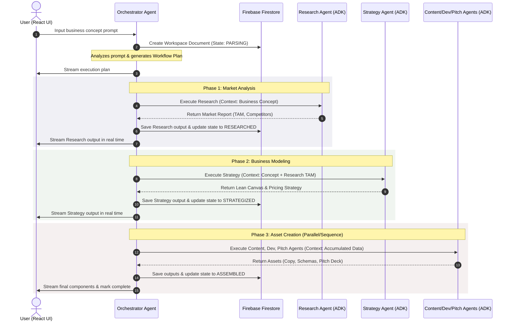
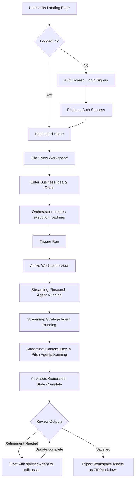

# Product Requirements Document (PRD) - COMET

## 1. Context

In the modern entrepreneurial landscape, startups, founders, freelancers, and students face a highly fragmented ecosystem of AI productivity tools. To complete a standard business workflow—such as researching a market, drafting a business model, creating promotional content, drafting technical specifications, and building an investor pitch—users must constantly switch between multiple single-purpose AI chat interfaces. This manual context-switching results in fragmented context, high cognitive load, and disjointed business outputs.

**COMET (Multi-Agent Business Orchestrator)** is conceived to solve this problem by providing a unified workspace. Through a centralized orchestrator and a suite of five specialized agents (Research, Strategy, Content, Development, and Pitch), COMET automates end-to-end business workflows. It manages context propagation across agents, allowing users to transform a single high-level business idea into a comprehensive, cohesive launch package.

---

## 2. Objective

The primary objective of COMET is to build an intuitive, web-based multi-agent orchestration platform that allows users to:
1. Input a single business concept or goal and receive a structured, multi-disciplinary output compiled by specialized collaborative agents.
2. Interact with individual agents to refine specific domain deliverables (e.g., tweaking market research, adjusting financial assumptions, generating marketing copy).
3. Experience a seamless, high-performance user interface featuring real-time agent execution tracking, state visualization, and comprehensive workspace exports.
4. Establish a secure, role-based environment that enforces clear agent permission boundaries, prevents execution loops, and ensures low-latency response times.

---

## 3. Scope

### Vision
To become the premier open-source multi-agent business operating system, enabling anyone to go from "idea" to "execution-ready business assets" in under five minutes.

### Goals
- **Unified Context**: Establish a shared context state (the "Workspace Context") that is automatically passed and updated between agents.
- **Specialized Execution**: Define clear, deterministic responsibilities for five core agents, leveraging the Gemini 2.5 Flash model for reasoning and Google ADK for agent coordination.
- **Workflow Automation**: Support a linear sequential workflow (Orchestrator -> Research -> Strategy -> Content / Development / Pitch) as the primary MVP pattern, with optional user-in-the-loop interventions.
- **Premium User Experience**: Build a high-fidelity dashboard in React and Tailwind CSS that visualizes active agent reasoning, progress bars, and intermediate drafts.

### Non-Goals
- **Arbitrary Agent Creation**: Allowing users to build custom agents from scratch or import custom models (MVP is restricted to the 5 core agents).
- **Direct Code Deployment**: Running or deploying code created by the Development Agent (it provides architecture docs and code snippets, but does not compile or host code).
- **Live Financial Auditing**: Providing actual financial advisory or certified legal documentation. All outputs are templates and drafts.
- **Third-Party API Integrations**: Integrating with external CRM, ERP, or marketing platforms (e.g., Salesforce, Hubspot) for the MVP.

### Pain Points Addressed
- **Context Drift**: Standard LLM chats lose context when copy-pasting text from one window to another.
- **High Friction**: Writing prompts for five different tasks takes significant effort and requires prompt-engineering expertise.
- **Lack of Collaboration**: Standard tools do not allow agents to comment on or update each other’s outputs.

### Target Users
1. **Early-Stage Founders**: Need to quickly validate ideas, draft business plans, and prepare pitch decks.
2. **Freelancers / Agencies**: Need to accelerate client discovery, project scoping, and proposal generation.
3. **Business Students**: Need an educational sandbox to simulate business creation, market analysis, and product management.

---

## 4. Detailed Explanation

### 4.1 Problem Statement
Starting a new business or launching a product requires multiple distinct phases: market research, business model canvas formulation, marketing material creation, system architecture design, and investor pitch preparation. Each phase demands a different mindset, style of writing, and depth of technical detail. Current AI solutions are isolated conversational agents. Users cannot easily feed the market size data discovered in "chat 1" into the pricing calculations in "chat 2" or use the system specifications in "chat 3" to create the landing page copy in "chat 4."

COMET solves this by establishing a central **Orchestrator Agent**. The Orchestrator parses the user's initial prompt, creates an execution plan, updates the global workspace state, and routes execution to the appropriate specialized agents in sequence, maintaining a single, consistent thread of context throughout.

### 4.2 Core Features
1. **Central Orchestrator**:
   - Parses user input and determines the target execution plan.
   - Manages state machine transitions (Idle, Parsing, Researching, Strategizing, Executing_Subagents, Assembled).
   - Handles data flow between agents using a structured shared JSON context.
2. **Research Agent**:
   - Focuses on competitor analysis, target demographics, and market size estimates (TAM, SAM, SOM).
   - Generates structured tables of direct/indirect competitors.
3. **Strategy Agent**:
   - Creates a Lean Business Canvas, suggests pricing models, and generates a Go-To-Market (GTM) roadmap.
   - Translates market size data from the Research Agent into pricing strategy guardrails.
4. **Content Agent**:
   - Generates copywriting assets: elevator pitches, launch marketing emails, and social media posting schedules.
5. **Development Agent**:
   - Drafts technical system architecture diagrams (in text or Mermaid syntax), database schema definitions (Firebase, SQL), and boilerplate code structure.
6. **Pitch Agent**:
   - Outlines an 8-slide investor pitch deck and summarizes financial projections based on GTM costs and pricing plans.

### 4.3 App Flow (User Journey)
1. **Workspace Creation**: The user logs in via Firebase Auth, lands on the Dashboard, and clicks "New Workspace."
2. **Configuration Prompt**: The user enters their business concept (e.g., "A subscription-based micro-SaaS for local bakery deliveries").
3. **Orchestration Plan**: The Orchestrator generates a step-by-step roadmap. The user clicks "Start Orchestration."
4. **Step-by-Step Processing**:
   - **Researching**: The Research Agent executes, updating the UI with its intermediate thoughts and output.
   - **Strategizing**: The Strategy Agent consumes the Research data and drafts the business canvas.
   - **Executing Subagents**: The Content, Development, and Pitch agents run in parallel or sequence, using the accumulated context.
5. **Review & Refinement**: The user views the consolidated dashboard, reviews each agent's tab, and can prompt individual agents to refine their respective outputs.
6. **Export**: The user exports the completed launch package as a structured Markdown document or ZIP archive of files.

### 4.4 User Stories
- **As a Founder**, I want to enter my app idea once and receive a market report, business model, marketing emails, technical layout, and pitch deck outline so that I can validate my concept in minutes without repeating context.
- **As a Developer**, I want to review the database schema and system layout generated by the Development Agent and refine it via chat feedback without resetting the business model context.
- **As a Pitch Presenter**, I want the financial projections in my pitch outline to match the pricing strategy drafted by the Strategy Agent automatically.

### 4.5 Functional Requirements
- **FR-1 (Auth)**: Secure Firebase Auth login/signup with Google provider and Email/Password.
- **FR-2 (Workspace Management)**: Users can create, read, update, and delete workspaces. Each workspace contains the independent agent outputs.
- **FR-3 (Orchestration Engine)**: A FastAPI backend using Google ADK to coordinate agent state machine transitions.
- **FR-4 (Real-time Stream)**: Execution logs and intermediate steps must stream to the client using Server-Sent Events (SSE) or WebSockets.
- **FR-5 (Agent Chat)**: Ability to chat with individual agents to edit/update their specific partition of the workspace context.
- **FR-6 (Data Export)**: Clean compilation of all outputs into a single Markdown file or JSON package.

### 4.6 Non-Functional Requirements
- **NFR-1 (Latency)**: Orchestrator routing analysis must resolve in under 3 seconds. Agent streaming must begin within 1.5 seconds of execution trigger.
- **NFR-2 (Security)**: Workspace data must be isolated per user. Firebase security rules must enforce user ownership of Firestore documents.
- **NFR-3 (Scalability)**: Stateless backend API instances deployed on Google Cloud Run to auto-scale on request volume.
- **NFR-4 (Reliability)**: Automatic agent retry mechanism if the Google ADK/Gemini API fails or rate limits trigger.
- **NFR-5 (Accessibility)**: Frontend specification must comply with WCAG 2.1 AA standards (color contrast ratios >= 4.5:1, screen reader tags).

---

## 5. Tables

### Table 1: Core Agents Specification
| Agent Name | Primary Responsibility | Key Context Consumed | Key Deliverables Produced |
| :--- | :--- | :--- | :--- |
| **Orchestrator** | Coordinates workflows, parses user prompts, manages state transitions | User initial input, global workspace history | Execution plan, state updates, routing decisions |
| **Research** | Market research, customer discovery, competitor identification | Target niche, industry keywords | Competitive landscape table, target persona description, TAM/SAM/SOM estimates |
| **Strategy** | Business models, pricing strategies, GTM plan | Market size (Research), pricing constraints | Lean Business Canvas, pricing tiers, 90-day launch roadmap |
| **Content** | Marketing copy, email campaigns, social schedules | Target persona (Research), GTM strategy (Strategy) | 3 marketing email templates, 7-day social media calendar, taglines |
| **Development** | Technical specs, architecture design, database schematics | Product concept, feature priorities | Mermaid architecture chart, database schema, boilerplate files structure |
| **Pitch** | Investor communication, financial summaries, deck structure | Pricing tiers (Strategy), TAM (Research), GTM costs | 8-slide pitch deck structure, elevator pitch, 3-year revenue forecast outline |

### Table 2: Functional Requirements Prioritization Matrix (MoSCoW)
| Requirement ID | Description | Priority | Target Milestone |
| :--- | :--- | :--- | :--- |
| **FR-1** | User authentication and workspace isolation | Must Have | MVP Sprint 1 |
| **FR-2** | Sequential Agent Orchestration execution (Research -> Strategy -> Pitch) | Must Have | MVP Sprint 1 |
| **FR-3** | Real-time SSE streaming of agent thoughts and outputs | Must Have | MVP Sprint 2 |
| **FR-4** | Interactive refinement chat with individual agents | Must Have | MVP Sprint 2 |
| **FR-5** | Workspace export to Markdown format | Should Have | MVP Sprint 3 |
| **FR-6** | Development and Content Agent integration | Should Have | MVP Sprint 3 |
| **FR-7** | Parallel agent execution execution branch | Could Have | Post-MVP |
| **FR-8** | Version control & draft comparison for agent outputs | Won't Have | Future Scope |

### Table 3: Success Metrics
| Metric Category | Key Performance Indicator (KPI) | Target Value (MVP) | Measurement Tool |
| :--- | :--- | :--- | :--- |
| **Performance** | API Response Latency (Orchestrator plan) | < 3,000 ms | Google Cloud Logging |
| **Performance** | Agent Token Stream Time-to-First-Byte | < 1,500 ms | Web vitals monitoring |
| **Quality** | Agent context consistency validation rate | 95% error-free context | ADK Schema Validation checks |
| **Engagement** | Average time to generate full workspace assets | < 4 minutes | Execution duration logging |
| **UX** | Workspace creation completion rate | > 80% | Firebase Analytics |

---

## 6. Diagrams

### 6.1 High-Level Multi-Agent Orchestration Flow


### 6.2 App User Flow Diagram


---

## 7. Acceptance Criteria

To be accepted as functional, the COMET system must satisfy the following conditions:
1. **Workspace Context Integrity**: When transitioning between agents, the outputs of the previous agent must be appended to the context payload of the next agent. The Strategy Agent must be able to read and cite the TAM numbers generated by the Research Agent.
2. **Deterministic State Progression**: A workspace must transition from `CREATED` -> `RUNNING` -> `COMPLETED` or `FAILED`. The system must never enter a state loop or hang indefinitely. A timeout of 90 seconds per agent execution must be strictly enforced.
3. **No Cross-User Access**: Workspace documents in Firestore must not be readable or writeable by anyone other than the authenticated user who created them, verified via Firebase Rule simulators.
4. **Incremental Rendering**: The React frontend must display incremental token updates as they stream from the FastAPI server, avoiding "loading blocks" or blank text elements for the user interface.
5. **No Hallucination in Schema**: Agent outputs must match the defined Pydantic validation schemas in the backend. An output that is missing required fields (e.g., pricing tiers in Strategy, slide titles in Pitch) must automatically trigger a single retry.

---

## 8. Future Improvements

- **Agent Collaboration Loop**: Enabling agents to peer-review outputs (e.g., the Strategy Agent evaluates the Pitch Agent’s financial projections and sends feedback to refine them before presenting to the user).
- **Direct Workspace Imports**: Allowing users to upload existing business documents, competitor PDFs, or market study files to seed the Workspace Context.
- **Custom Agent Blueprints**: Allowing power users to configure a custom agent with specialized system prompts and insert it into the pipeline.
- **Interactive UI Canvas**: Transforming the frontend dashboard into a visual canvas (e.g., React Flow) where users can drag-and-drop agents and draw custom execution lines between them.

---

## 9. Risks

1. **API Rate Limiting**: The Google Gemini API may enforce rate limits (requests/min, tokens/min) during heavy usage.
   * *Mitigation*: Implement exponential backoff, request queuing in FastAPI, and fallback to cached templates if an agent execution fails twice.
2. **Context Window Limitations**: Accumulating the context of all five agents may exceed the standard system performance thresholds, causing slowdowns.
   * *Mitigation*: Leverage Gemini 2.5 Flash's large context capability, but use structured JSON summarizing at the end of each agent step to send only relevant data to subsequent agents.
3. **Infinite Orchestration Loops**: A bug in routing logic could cause the orchestrator to call the Research Agent repeatedly.
   * *Mitigation*: Hardcode a maximum stack execution depth of 8 total agent invocations per workspace run.
4. **Security Leakage**: Users putting proprietary or sensitive business models into COMET.
   * *Mitigation*: Implement strict SSL, data encryption at rest in Firebase, and ensure data processed by Gemini 2.5 via Google Cloud Enterprise APIs is not used to train public LLM models.

---

## 10. Notes

- **Technology Selection Rationale**:
  - *React + Tailwind CSS*: Provides rapid, component-driven UI implementation with clean styling that supports premium aesthetics.
  - *FastAPI*: High-performance asynchronous Python framework suited for handling long-lived HTTP connections and Server-Sent Events (SSE).
  - *Google ADK*: Specifically designed for managing structured multi-agent interactions, system prompts, and state.
  - *Firebase*: Provides zero-ops production-grade auth, real-time database syncing, and hosting.
- **Assumptions**: We assume the workspace operates strictly under single-user write operations. Multi-user real-time collaborative editing (Google Docs style) is deferred.

---

## 11. AI Implementation Instructions

Downstream AI developer agents building the COMET workspace must strictly adhere to the following code guidelines:
1. **Maintain Context Struct**: Keep a single, standardized, typed data model representing the Workspace state:
   ```json
   {
     "workspace_id": "string",
     "user_id": "string",
     "business_concept": "string",
     "state": "CREATED | RUNNING | COMPLETED | FAILED",
     "plan": ["array of steps"],
     "research": { "competitors": [], "market_size": {}, "report": "string" },
     "strategy": { "lean_canvas": {}, "pricing_tiers": [], "roadmap": [] },
     "content": { "emails": [], "social_calendar": [], "taglines": [] },
     "development": { "architecture_mermaid": "string", "database_schema": "string" },
     "pitch": { "deck_slides": [], "elevator_pitch": "string", "financials": {} }
   }
   ```
2. **ADK Orchestration Router**: The orchestrator must be a controller class in the FastAPI backend (`app/orchestration/router.py`) that processes workflow pipelines using state transitions and calls individual agent classes sequentially.
3. **Streaming Requirement**: Implement agent responses using FastAPI's `StreamingResponse` using the format:
   ```text
   event: agent_log
   data: {"agent": "research", "thought": "Analyzing competitor X..."}
   
   event: agent_delta
   data: {"text_chunk": "Competitor X is..."}
   ```
4. **CSS Styling**: Apply only Tailwind utility classes combined with custom CSS gradients and borders. Do not use random inline styling tags.

---

## 12. Validation Checklist

- [ ] Does this document outline a clear workflow starting with the central Orchestrator?
- [ ] Are the responsibilities and deliverables for all 5 core agents explicitly defined?
- [ ] Does the document contain the 12 required sections as per the Documentation Rules?
- [ ] Is there a clear MoSCoW prioritization matrix table for requirements?
- [ ] Is a Mermaid sequence diagram showing the multi-agent context flow included?
- [ ] Are the technical choices (React, Tailwind, FastAPI, Google ADK, Gemini, Firebase) strictly adhered to without placeholders?
- [ ] Is the document free of "Lorem Ipsum" and generic placeholder content?
