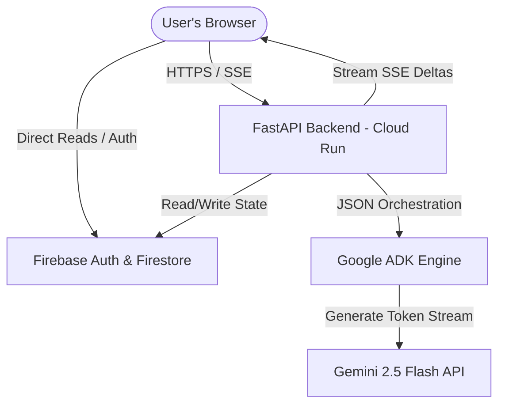
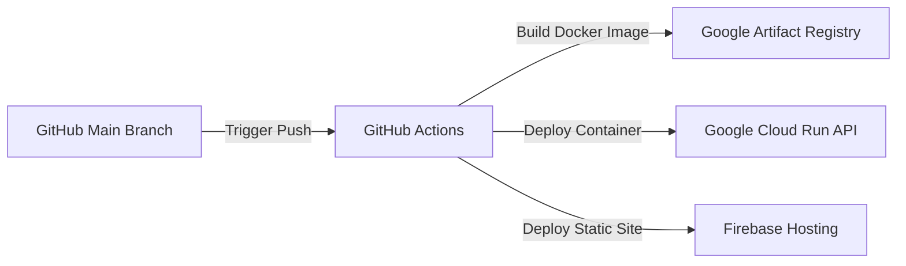

# Technical Architecture Document - COMET

## 1. Context

COMET is a multi-agent orchestration platform that requires a highly responsive frontend for visualizing real-time agent output and a stateless, scale-to-zero backend to execute complex agent workloads. The technical architecture must bridges these systems, managing long-lived agent runtimes (via FastAPI and Server-Sent Events) and persistent multi-agent states (via Firebase Firestore).

---

## 2. Objective

The objective of this document is to define the system-level engineering blueprints for COMET. It details the complete technology stack, Folder structures, Firestore database schemas, API contracts, state management, security layers, deployment guidelines, and optimization plans. This ensures that the codebase remains modular, performant, and secure under high request concurrency.

---

## 3. Scope

### In Scope
- **Tech Stack**: React 18+ (Vite), Tailwind CSS 3+, FastAPI (Python 3.11+), Google ADK (Agent Development Kit), Gemini 2.5 Flash API, Firebase (Auth & Firestore), Google Cloud Run, GitHub Actions.
- **Data Models**: Firestore collection designs for Users, Workspaces, and Agent Runs, including indexing requirements.
- **Backend Flow**: Asynchronous Python runtime, utilizing standard Pydantic models for request validation and custom SSE streaming middleware.
- **Frontend Architecture**: React Context/Zustand state management coupled with custom event listeners for streaming updates.

### Out of Scope
- **Self-Hosted LLMs**: Scaling or deploying open-source models (Llama, Mistral). We rely strictly on Gemini 2.5 Flash.
- **WebSockets Transport**: Direct WebSockets implementation (we utilize HTTP/1.1 SSE for unidirectional agent-to-client streaming, keeping connections lightweight and compatible with standard serverless containers).
- **Multi-region Database Replication**: Firestore global replica clustering. We target standard single-region (e.g., `us-central1`) for low latency.

---

## 4. Detailed Explanation

### 4.1 Technology Stack & Rationale

| Component | Technology | Rationale |
| :--- | :--- | :--- |
| **Frontend Web** | React (Vite) | High performance, virtual DOM rendering, and immediate hot-reloads during development. Highly suited for real-time state visualization. |
| **Styling** | Tailwind CSS | Utility-first framework allowing fast implementation of custom dark modes, premium glassmorphism gradients, and consistent layouts. |
| **Backend API** | FastAPI | High-performance asynchronous Python framework. Fast execution, automatic OpenAPI generation, and native async streaming support via Server-Sent Events. |
| **Multi-Agent Engine**| Google ADK | The official Google SDK for agent building. Standardizes prompt construction, memory parsing, tool injection, and schema enforcement for Gemini models. |
| **Core LLM** | Gemini 2.5 Flash | Provides rapid tokens-per-second, large context window (1M+ tokens), and low-cost API execution, making multi-step agent reasoning economically viable. |
| **Database** | Firebase Firestore | NoSQL document store with native real-time synchronization, automatic scaling, and secure direct-client reads via Security Rules. |
| **Auth** | Firebase Auth | Ready-made email/password and social login (Google) integration with secure client token verification. |
| **Hosting & API Deployment** | Google Cloud Run | Serverless container hosting that scales-to-zero when idle, minimizing costs, and supports HTTP streaming and auto-scaling up to thousands of requests. |
| **CI/CD** | GitHub Actions | Automated build, linting, test suites, and continuous container deployment pipelines to Cloud Run. |

### 4.2 System Component Architecture


### 4.3 Workspace Folder Structure (Feature-Based)

```text
comet-workspace/
├── .github/
│   └── workflows/
│       ├── frontend-deploy.yml
│       └── backend-deploy.yml
├── backend/
│   ├── app/
│   │   ├── __init__.py
│   │   ├── main.py              # FastAPI Application Entry
│   │   ├── core/                # Core Config, Logger, Security
│   │   │   ├── config.py
│   │   │   ├── security.py
│   │   │   └── logging.py
│   │   ├── db/                  # Firestore Client & DB Utils
│   │   │   └── firestore.py
│   │   ├── schemas/             # Pydantic Schemas (Input/Output validation)
│   │   │   ├── workspace.py
│   │   │   └── agent.py
│   │   ├── orchestration/       # Core Orchestrator Logic
│   │   │   ├── router.py        # Orchestration State Machine
│   │   │   └── context_manager.py
│   │   ├── agents/              # Individual Agent ADK Definitions
│   │   │   ├── base.py          # Abstract Agent Class
│   │   │   ├── research.py
│   │   │   ├── strategy.py
│   │   │   ├── content.py
│   │   │   ├── development.py
│   │   │   └── pitch.py
│   │   └── api/                 # API Routes
│   │       ├── auth.py          # ID Token validation middleware
│   │       ├── workspaces.py    # CRUD and execute endpoints
│   │       └── health.py
│   ├── tests/                   # Pytest suites
│   ├── Dockerfile
│   └── requirements.txt
├── frontend/
│   ├── public/
│   ├── src/
│   │   ├── main.jsx
│   │   ├── index.css
│   │   ├── App.jsx
│   │   ├── components/          # Reusable Generic UI (Buttons, Modals, Cards)
│   │   │   ├── Button.jsx
│   │   │   ├── Input.jsx
│   │   │   └── Card.jsx
│   │   ├── layout/              # Navbars, Sidebars, View Shells
│   │   │   ├── DashboardLayout.jsx
│   │   │   └── Sidebar.jsx
│   │   ├── context/             # Global Context / State
│   │   │   ├── AuthContext.jsx
│   │   │   └── WorkspaceContext.jsx
│   │   ├── features/            # Feature-Based Modules
│   │   │   ├── auth/            # Login, Signup components
│   │   │   │   └── AuthScreen.jsx
│   │   │   ├── dashboard/       # Workspace grid
│   │   │   │   └── WorkspaceGrid.jsx
│   │   │   └── workspace/       # Active execution and tabs
│   │   │       ├── WorkspaceDetail.jsx
│   │   │       ├── OrchestratorConsole.jsx
│   │   │       └── AgentTab.jsx
│   │   └── utils/               # SSE connection helpers & date formatters
│   │       └── api.js
│   ├── tailwind.config.js
│   ├── vite.config.js
│   └── package.json
└── README.md
```

---

## 5. Database Schema & Collections (Firebase Firestore)

Firestore stores data as documents in hierarchical collections. All root-level collections are structured to enforce secure query limits.

### 5.1 Collection: `users`
- **Path**: `/users/{uid}`
- **Description**: Holds security metadata and user profile details.
- **Fields**:
  ```json
  {
    "uid": "string (matches Firebase Auth UID)",
    "email": "string",
    "displayName": "string",
    "role": "admin | member | guest",
    "createdAt": "timestamp",
    "lastLoginAt": "timestamp"
  }
  ```

### 5.2 Collection: `workspaces`
- **Path**: `/workspaces/{workspaceId}`
- **Description**: Main entity containing the prompt context and consolidated outputs of the run.
- **Fields**:
  ```json
  {
    "workspaceId": "string (UUID v4)",
    "userId": "string (ref: users.uid)",
    "title": "string",
    "businessConcept": "string (initial prompt)",
    "state": "CREATED | RUNNING | COMPLETED | FAILED",
    "plan": ["string (step list)"],
    "createdAt": "timestamp",
    "updatedAt": "timestamp",
    "outputs": {
      "research": {
        "report": "string (Markdown)",
        "competitors": [
          { "name": "string", "strengths": "string", "weaknesses": "string" }
        ],
        "tam_sam_som": { "tam": "number", "sam": "number", "som": "number" }
      },
      "strategy": {
        "lean_canvas": {
          "problem": "string",
          "solution": "string",
          "channels": "string",
          "revenue_streams": "string"
        },
        "pricing_tiers": [
          { "name": "string", "price": "number", "features": ["string"] }
        ],
        "roadmap_days": ["string"]
      },
      "content": {
        "taglines": ["string"],
        "emails": [{ "subject": "string", "body": "string" }],
        "social_calendar": [{ "day": "number", "post": "string" }]
      },
      "development": {
        "architecture_mermaid": "string",
        "database_schema": "string",
        "boilerplate_structure": "string"
      },
      "pitch": {
        "elevator_pitch": "string",
        "deck_slides": [{ "slideNumber": "number", "title": "string", "bullets": ["string"] }],
        "financials": { "revenue_y1": "number", "revenue_y2": "number", "revenue_y3": "number" }
      }
    }
  }
  ```

### 5.3 Collection: `agent_runs`
- **Path**: `/agent_runs/{runId}`
- **Description**: Audit logs tracking individual agent executions within a workspace.
- **Fields**:
  ```json
  {
    "runId": "string (UUID v4)",
    "workspaceId": "string (ref: workspaces.workspaceId)",
    "agentName": "research | strategy | content | development | pitch",
    "status": "PENDING | EXECUTING | COMPLETED | FAILED",
    "inputContext": "map (JSON subset passed to agent)",
    "outputData": "map (JSON subset returned by agent)",
    "executionLogs": [
      { "timestamp": "timestamp", "log": "string" }
    ],
    "startedAt": "timestamp",
    "completedAt": "timestamp"
  }
  ```

### 5.4 Indexes (Firestore Rules requirement)
- **Single Field Indexes**: Automatically created by default.
- **Composite Indexes**: Required for workspace listings and stats.
  - `/workspaces` -> `userId` (ASC) + `createdAt` (DESC)
  - `/agent_runs` -> `workspaceId` (ASC) + `startedAt` (ASC)

---

## 6. API Structure & Contracts

All endpoints prefix with `/api/v1` and require an Authorization Header: `Authorization: Bearer <firebase_id_token>`.

### 6.1 API Table Summary
| Endpoint | Method | Security | Description |
| :--- | :--- | :--- | :--- |
| `/auth/verify` | POST | Authenticated | Verifies ID Token and registers user document |
| `/workspaces` | GET | Authenticated | Retrieves all workspaces owned by the user |
| `/workspaces` | POST | Authenticated | Creates a new empty workspace |
| `/workspaces/{id}` | GET | Authenticated | Fetches details of a specific workspace |
| `/workspaces/{id}` | DELETE | Authenticated | Deletes a workspace |
| `/workspaces/{id}/run` | POST | Authenticated | Triggers sequential execution (Streams SSE) |
| `/workspaces/{id}/refine` | POST | Authenticated | Triggers refinement chat with an agent (Streams SSE)|

### 6.2 POST `/workspaces/{id}/run` SSE Stream Specification
- **Event: `plan_initialized`**
  - Data payload: `{"plan": ["research", "strategy", "pitch"]}`
- **Event: `agent_started`**
  - Data payload: `{"agent": "research"}`
- **Event: `agent_thought`**
  - Data payload: `{"thought": "Searching Google for competitor data..."}`
- **Event: `agent_stream`**
  - Data payload: `{"delta": "Competitor Analysis: ..."}`
- **Event: `agent_completed`**
  - Data payload: `{"agent": "research", "output": {...}}`
- **Event: `run_finished`**
  - Data payload: `{"status": "success", "workspace_id": "uuid"}`

---

## 7. State Management & Authentication

### 7.1 Client-Side Authentication Flow
1. **User Sign Up/In**: User submits credentials to Firebase Auth via standard SDK.
2. **Token Retrieval**: React frontend acquires the ID token using `auth.currentUser.getIdToken()`.
3. **API Injection**: The token is stored in memory and attached as `Bearer <token>` to all HTTP requests.
4. **Firebase SDK Sync**: Direct reads for active workspace variables utilize the Firebase firestore listener (`onSnapshot`) to automatically refresh the client UI when backend calculations write outputs to the database.

### 7.2 Frontend State Store (Zustand or React Context)
- **`AuthStore`**: Controls `user` object, `loading` state, and credentials status.
- **`WorkspaceStore`**: Holds current list of user workspaces, active workspace ID, selected active tab, streaming logs array, and active execution status (`isStreaming`).

---

## 8. Deployment Plan



- **Frontend Deployment**: Hosted on Firebase Hosting, which provides a globally cached CDN and automatic SSL certificate generation.
- **Backend Deployment**: Fastapi API packaged into a Docker image, pushed to Google Artifact Registry, and deployed on Google Cloud Run.
  - Concurrency: Max 80 per instance.
  - Memory: 1GB, CPU: 1 vCPU.
  - Min Instances: 0 (Scale to zero when inactive), Max Instances: 10.

---

## 9. Future Improvements

- **Workflow Caching**: If a user runs orchestration on an identical prompt, fetch cached Research outputs to save API costs.
- **Direct Webhooks**: Post updates to external channels (e.g., Slack or Discord) when agent runs finish execution.
- **SQL / DuckDB Integration**: Include local database analytical support inside the Strategy and Research agent containers for performing complex spreadsheets evaluations.

---

## 10. Risks

1. **Firestore Concurrent Write Quotas**: Multiple agents writing to the same workspace document simultaneously can fail due to Firestore's 1 write per second document rate limit.
   * *Mitigation*: The backend orchestrator serializes agent writes by buffering output in-memory and issuing a single consolidation update per agent phase completion.
2. **Cloud Run Cold Start Latency**: Scaling from 0 to 1 instance can add 5–8 seconds to the initial API request.
   * *Mitigation*: Keep min-instances to 1 for production environments or implement a lightweight ping mechanism in the React frontend that wakes the backend container when the user lands on the dashboard.

---

## 11. AI Implementation Instructions

Downstream AI backend developers must construct the agent routers as follows:
- **Base Agent Design Pattern**: Define an abstract base class (`app/agents/base.py`):
  ```python
  from abc import ABC, abstractmethod
  from google.adk import Agent  # Assumed ADK Import structure

  class COMETBaseAgent(ABC):
      def __init__(self, name: str, system_instruction: str):
          self.name = name
          self.system_instruction = system_instruction
          
      @abstractmethod
      async def execute(self, shared_context: dict) -> dict:
          pass
  ```
- **Gemini Model Parameters**: Default `temperature=0.4` for factual accuracy in Research/Strategy, and `temperature=0.7` for Content copy writing.

---

## 12. Validation Checklist

- [ ] Are all technologies defined (Vite, React, Tailwind, FastAPI, Firestore, Google ADK)?
- [ ] Is the folder structure modular and feature-based?
- [ ] Is the detailed Firestore schema documented for `users`, `workspaces`, and `agent_runs`?
- [ ] Are compound queries for indexes documented?
- [ ] Is the SSE API streaming payload event structure mapped out?
- [ ] Are deployment strategies for Firebase Hosting and Google Cloud Run included?
- [ ] Does the document contain the required 12 sections?
