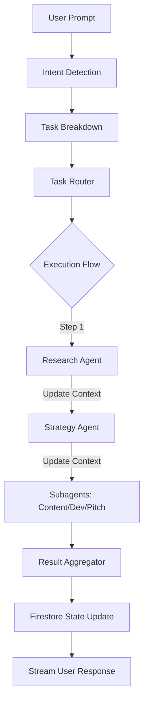

# permanent memory - COMET

## 1. Context

Modern businesses, founders, freelancers, and students face high operational friction when trying to execute workflows across separate AI interfaces. **COMET (Multi-Agent Business Orchestrator)** is a centralized platform designed to solve this fragmentation by orchestrating collaborative AI agents (Research, Strategy, Content, Development, and Pitch) under a single shared workspace context.

This `memory.md` file serves as the permanent memory, conceptual anchor, and root source of truth for the COMET project. All engineering designs, security rules, frontend components, and task tickets must align with the instructions and principles documented here.

---

## 2. Objective

The objective of COMET is to deliver a production-ready AI SaaS environment where:
1. Users can input a single high-level business objective and receive a structured portfolio of strategy, market, content, development, and pitch outputs.
2. A centralized Task Router coordinates parallel and sequential agent executions dynamically.
3. State, configuration inputs, and generated logs are saved and synced using Firebase Firestore and streamed via Server-Sent Events.

---

## 3. Scope

### In Scope
- **Current MVP Agents**:
  1. *Research Agent*: Market research, competitor analysis, industry insights.
  2. *Strategy Agent*: Business planning, growth strategy, roadmaps.
  3. *Content Agent*: Blogs, emails, marketing copy, reports.
  4. *Development Agent*: Technical architecture, code assistance, documentation.
  5. *Pitch Agent*: Investor decks, executive summaries, startup pitches.
- **Tech Stack**: React.js, Tailwind CSS, FastAPI, Google Agent Development Kit (ADK), Google Gemini 2.5 Flash, Firebase (Firestore, Auth), Google Cloud Platform, GitHub.
- **Key Deliverables**: Workspace dashboards, active streaming monitors, individual agent refinement chat.

### Non-Goals (Version 1)
- Mobile Application.
- Real-time multi-user team collaboration.
- CRM integrations (Salesforce, Hubspot, etc.).
- Billing/Subscription paywalls.
- Public agent sharing marketplace.
- Voice assistant controls.

---

## 4. Detailed Explanation

### 4.1 Problem Statement
Modern businesses rely on multiple disconnected tools to perform research, strategy planning, software development, content generation, and investor communication. Switching between these tools wastes time, increases operational complexity, duplicates work, and slows execution. COMET solves this by orchestrating specialized AI agents that collaborate within a single workflow.

### 4.2 High-Level Architecture
The orchestration pipeline routes user requests through a central gateway into specialized subagents:
```text
User
  ↓
COMET Dashboard
  ↓
Orchestrator
  ↓
Task Router
  ↓
Research Agent ──> Strategy Agent ──> Content Agent / Development Agent / Pitch Agent
  ↓
Result Aggregator
  ↓
Unified Response
```

### 4.3 Data Flow
1. **User Prompt**: User enters a product/service concept.
2. **Intent Detection**: The Orchestrator parses objectives and extracts parameters.
3. **Task Breakdown**: The Orchestrator creates an execution schedule.
4. **Agent Selection**: Tasks are assigned to specialized agents.
5. **Sequential Execution**: Agents run in order, passing context downstream.
6. **Response Aggregation**: Results are compiled into the workspace object.
7. **Memory Update**: The workspace state updates in Firestore.
8. **User Response**: Outputs are streamed/rendered in the UI.

### 4.4 Coding Standards
- TypeScript preferred where applicable.
- Modular, feature-based folder structure.
- No duplicated business logic.
- Environment variables for all secrets.
- Reusable UI components.
- Consistent naming conventions.
- Comprehensive error handling.
- Responsive design across devices.

### 4.5 AI Generation Rules
When generating code:
- Never rename COMET.
- Never remove the five MVP agents.
- Never replace the orchestrator with a single-agent workflow.
- Do not introduce undocumented technologies.
- Reuse existing components before creating new ones.
- Maintain consistency with the PRD, Technical Architecture, Security, Frontend Specification, and Feature Tickets.

---

## 5. Tables

### Table 1: Core Target Users
| Target Segment | Primary Pain Point | COMET Solution Value |
| :--- | :--- | :--- |
| **Startup Founders** | High cost of business strategy planning | Dynamic GTM roadmaps and pricing models |
| **Freelancers** | Slow scoping and proposal writing | Rapid target demographic and outline generator |
| **Students** | Complex technical/business specs | Structured Lean Canvas templates and layouts |
| **Product Teams** | Fragmented feature specs | Automated database designs and Mermaid charts |

### Table 2: Document Dependency Order
| Dependency Priority | Document Name | Description |
| :---: | :--- | :--- |
| **1** | [memory.md](file:///d:/AGENT%20A%20THON/memory.md) | Central conceptual source of truth (this file) |
| **2** | [PRD.md](file:///d:/AGENT%20A%20THON/PRD.md) | Product specs, flows, and agent tasks |
| **3** | [TechnicalArchitecture.md](file:///d:/AGENT%20A%20THON/TechnicalArchitecture.md) | Directories, backend schemas, and API contracts |
| **4** | [SecurityAndAccess.md](file:///d:/AGENT%20A%20THON/SecurityAndAccess.md) | Auth, access matrix, and Firestore rules |
| **5** | [FrontendSpecification.md](file:///d:/AGENT%20A%20THON/FrontendSpecification.md) | Typography, UI tokens, and custom components |
| **6** | [FeatureTickets.md](file:///d:/AGENT%20A%20THON/FeatureTickets.md) | Granular sprint tasks and developer prompts |

---

## 6. Diagrams (Data Flow)



---

## 7. Acceptance Criteria

1. **Alignment**: Every code change, database schema migration, and API route addition must refer to the requirements defined in this `memory.md` document.
2. **Framework Compliance**: Solutions must utilize the designated React + Tailwind frontend, FastAPI backend, Google ADK + Gemini 2.5 Flash execution layer, and Firebase services.
3. **Agent Count**: The system must support the five core agents (Research, Strategy, Content, Development, Pitch) with a central Orchestrator. No single-agent shortcuts are permitted.

---

## 8. Future Improvements (Long-Term Goal)

- **AI Business Operating System**: Scaling to support additional agents:
  - *Marketing Agent* (ad campaigns, SEO keywording).
  - *Sales Agent* (outbound email automation).
  - *Finance Agent* (budget models, tax structures).
  - *HR Agent* (job descriptions, onboarding checklists).
  - *Legal Agent* (NDA, terms of service templates).
  - *Analytics Agent* (user metric dashboard insights).
- **Parallel Routing**: Optimize backend execution pipelines to support concurrent agent runs.

---

## 9. Risks

1. **Configuration Drift**: Downstream documents getting modified without updating `memory.md`.
   * *Mitigation*: Restrict direct writes to documentation unless verified against `memory.md` rules first.
2. **Technological Contradiction**: Developers attempting to substitute Firebase or FastAPI with alternative frameworks (e.g. Next.js backend).
   * *Mitigation*: Enforce system validation linting rules checking imports.

---

## 10. Notes

- Always check dependencies before upgrading Python or Node packages.
- Memory context variables in Firestore must stay under the maximum document size limit (1MB).

---

## 11. AI Implementation Instructions

- Treat `memory.md` as the system context payload for all coding subagents.
- Ensure that code generation checks and enforces typing parameters matching the designated database models.

---

## 12. Validation Checklist

- [ ] Does this file represent the single source of truth for identity, category, and purpose?
- [ ] Are the 5 core MVP agents documented?
- [ ] Is the designated tech stack (React, Tailwind, FastAPI, Google ADK, Gemini, Firebase) correct?
- [ ] Are the 12 required sections included?
- [ ] Is the file completely free of generic placeholder text?
